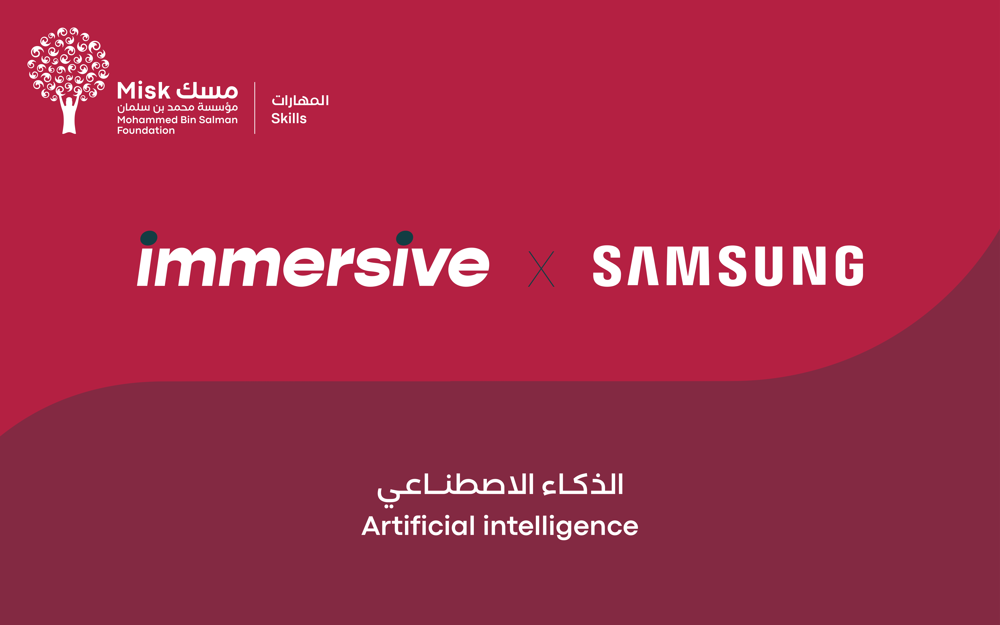
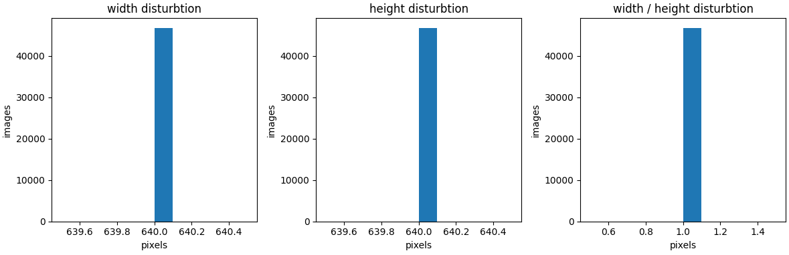
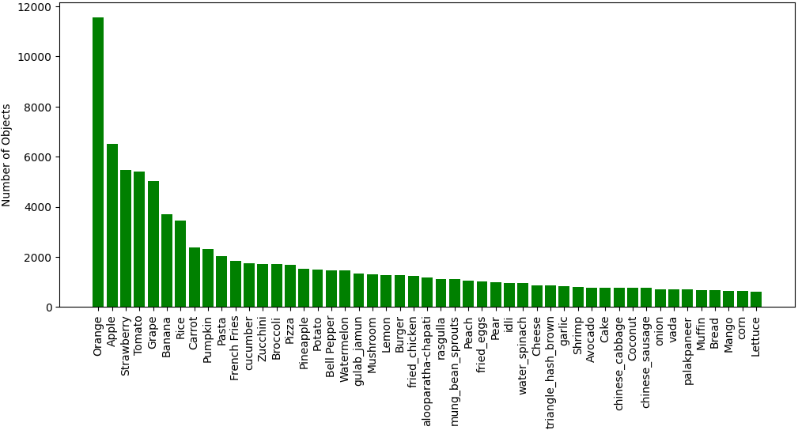
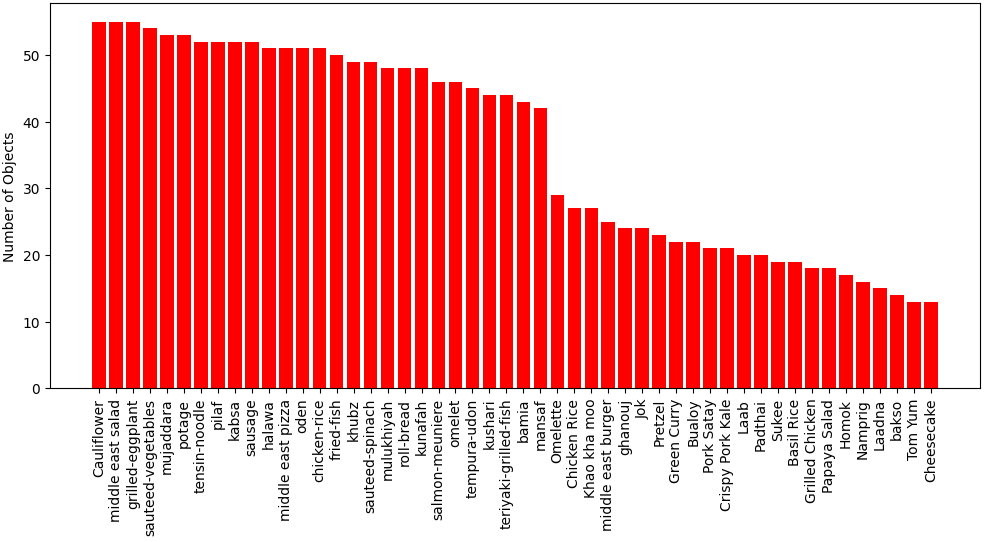
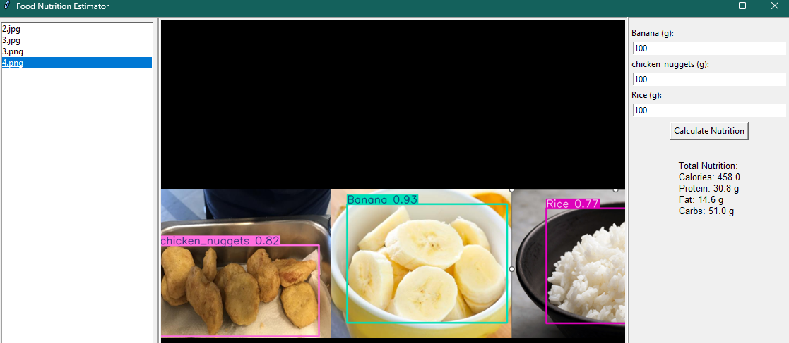

# Samsung Innovation Campus AI Program 
The Samsung Innovation Campus AI Program is an initiative designed to provide a deep dive into artificial intelligence, machine learning, and data processing. This 215-hour program combines asynchronous learning with blended sessions, featuring lectures, hands on exercises, and a capstone project. Participants will gain practical skills and theoretical knowledge, preparing them for a successful career in AI.

# 🎓 Capstone Project  

## 🍽️ Food Recognition & Macro Calculator  
An object detection model built with **YOLO** to recognize food items. After detection, users can enter the portion size in grams to calculate **calories** and **macronutrients** (protein, carbohydrates, fats).  

## 🔍 Overview  
- 🖼️ Uses **YOLO (You Only Look Once)** for real-time food detection.  
- ⚖️ After detecting food items, the user inputs the portion size (grams).  
- 🧮 The system calculates the **macronutrients** (protein, carbs, fats, calories).  

## 📊 Dataset  
The dataset is available on [Roboflow](https://universe.roboflow.com/nutrient-tracker/complete-food-ts01p).  

## 📈 Exploratory Data Analysis (EDA)  
Before training, an **EDA** was conducted to understand dataset distribution.  

- 📏 **Image dimensions**: width, height, and width/height ratio distribution.  
- 🍱 **Class distribution**: top 50 most frequent food classes and least 50 classes.  

### 🔹 Plots  

#### 📏 Width, Height, and Ratio Distribution  
  

#### 🍱 Top 50 Classes  
  

#### 🥢 Least 50 Classes  
  

## 🏋️ Model Training  
- Input size: **640x640**  
- Data augmentation: **Mosaic + Mixup**  
- Training on **20 epochs**.  

### 🔹 Training & Evaluation  
  

## 🚀 Demo Application  
A demo app was built to showcase the system:  

1. Upload a food image.  
2. The system detects the food items.  
3. User inputs the portion size (grams).  
4. The app returns calories and macros.  

### 🔹 Demo Screenshot  
  
